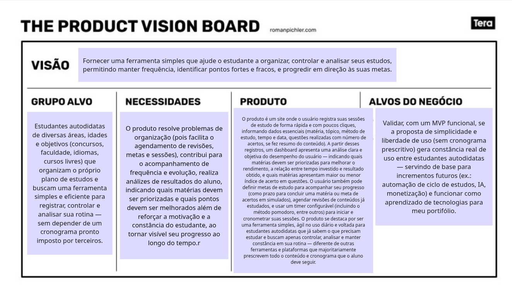
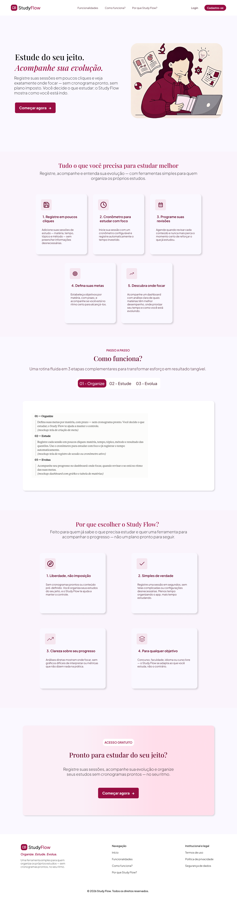

# Study Flow

Aplicação full-stack para controle e planejamento de estudos.

---

## Proposta de valor e entendimento do produto

Para alinhar as necessidades dos clientes com as funcionalidades do sistema, foi elaborado um Mapa de Valor:

Para definir, visualizar e validar o propósito do produto, foi elaborado um Product Vision Board:

## Requisitos do Sistema

Confira a lista completa de requisitos funcionais na [Documentação de Requisitos](docs/REQUISITOS.md).

## Protótipo da Interface (UI/UX)

O protótipo da Landing Page foi desenvolvido no Figma focado na definição do Design System do projeto.

